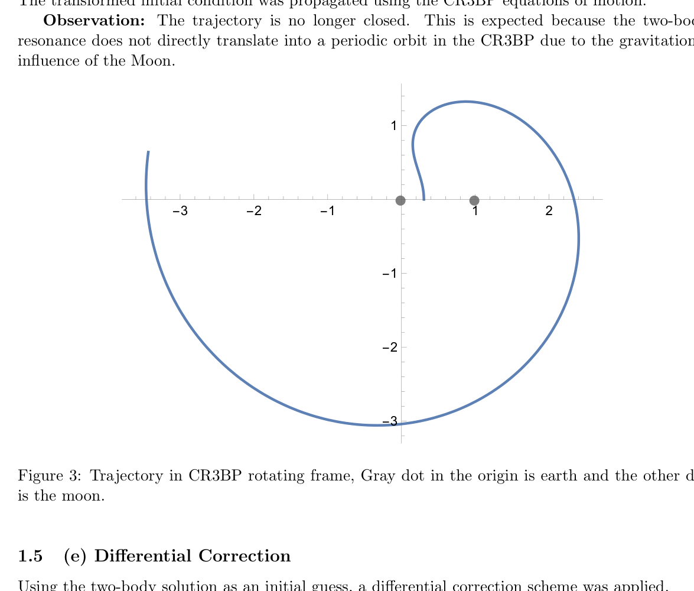
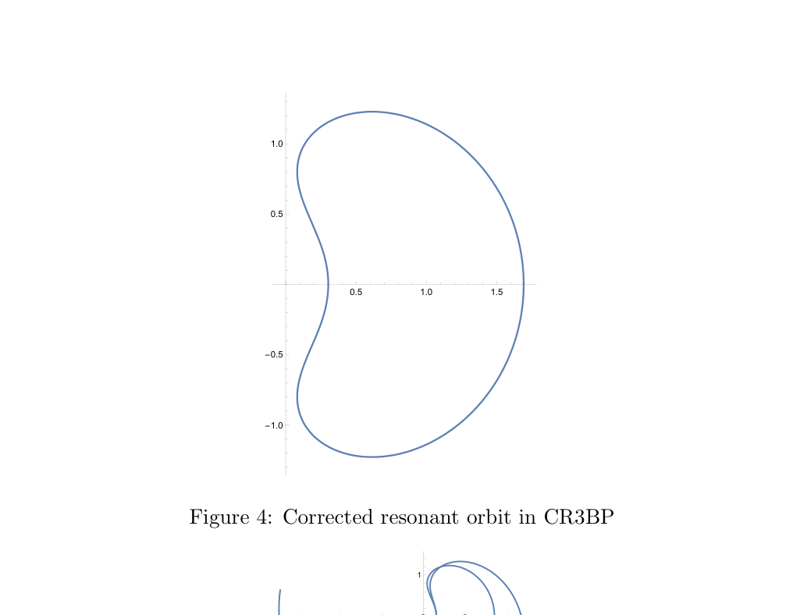
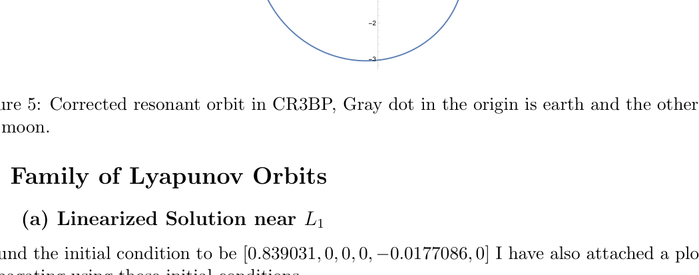
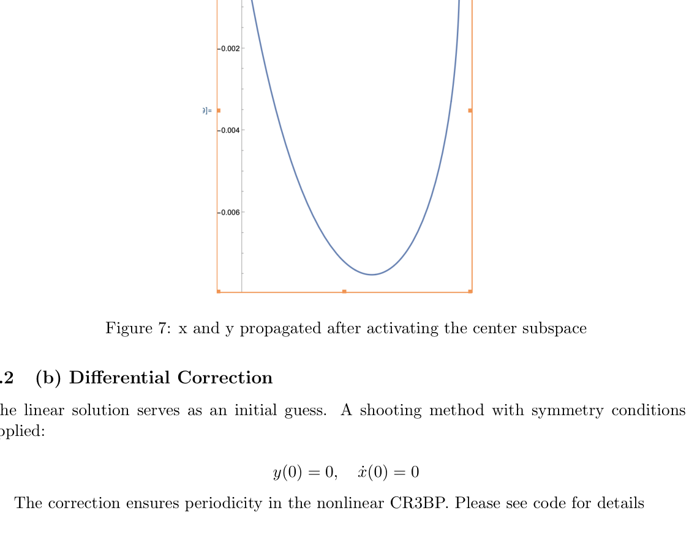
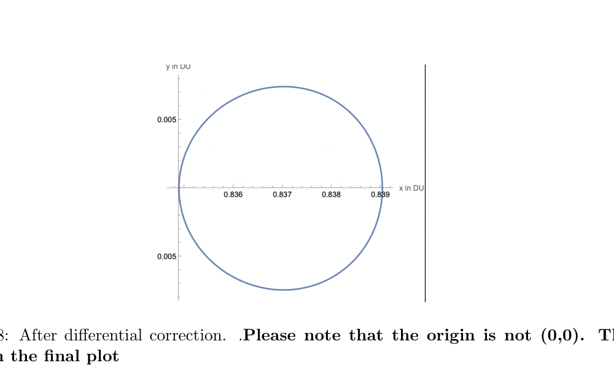
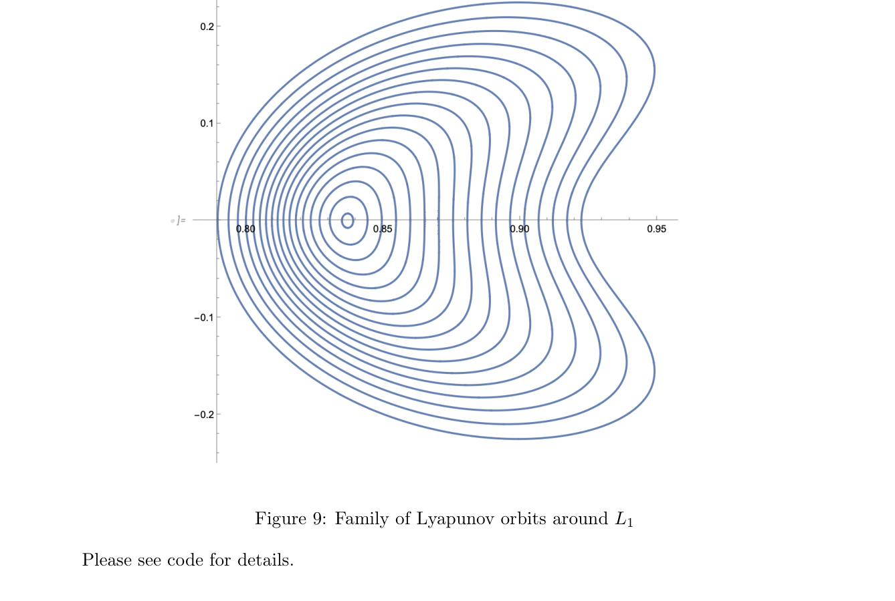

# AERSP 550 — HW4: Resonant Orbits & Lyapunov Orbit Families in the CR3BP

**Neena Noble | AERSP 550**

This homework explores two problems in the Circular Restricted Three-Body Problem (CR3BP): constructing a 3:4 resonant orbit between a spacecraft and the Moon, and computing a family of Lyapunov orbits around the Earth-Moon L1 Lagrange point. Both use differential correction with planar symmetry conditions to enforce periodicity in the full nonlinear CR3BP.

---

## Files

```
├── aerohw4.nb      # Problem 1: 3:4 resonant orbit — ECI setup, ECI→CR3BP transform, differential correction
├── aerohw4_2.nb    # Problem 2: Lyapunov orbit family — linearization near L1, differential correction, family continuation
└── aerohw4.pdf     # Written report with derivations, plots, and results
```

---

## Problem 1 — 3:4 Resonant Orbit in the CR3BP

A 3:4 resonance means the spacecraft completes **3 orbits** in the time the Moon completes **4 orbits**.

### (a) Semi-Major Axis from Kepler's Third Law

Using $T \propto a^{3/2}$ and the resonance condition $T_{sc}/T_M = 3/4$:

$$\left(\frac{a_{sc}}{a_M}\right)^{3/2} = \frac{3}{4} \implies a_{sc} = a_M \left(\frac{3}{4}\right)^{2/3}$$

With $a_M = 384{,}400$ km:

$$\boxed{a_{sc} = 465{,}667 \text{ km}}$$

### (b) Initial Conditions in ECI Frame

Given eccentricity $e = 0.75$, the periapsis radius and velocity are:

$$r_p = a_{sc}(1 - e), \quad v_p = \sqrt{\mu_E \frac{1+e}{a_{sc}(1-e)}}$$

With all other orbital elements zero (equatorial orbit, periapsis along x-axis):

$$\mathbf{r}(0) = [r_p,\; 0,\; 0], \quad \mathbf{v}(0) = [0,\; v_p,\; 0]$$

The spacecraft orbit (blue) and Moon's circular orbit (red) in the ECI frame:


### (c) ECI → CR3BP Frame Transformation

The transformation to the rotating (synodic) CR3BP frame is:

| Step | Operation |
|---|---|
| Normalize distance | $DU = 384{,}400$ km |
| Normalize time | $TU = T_M / 2\pi$ |
| Apply rotation | $\theta = t / TU$ |
| Subtract barycenter | $\mathbf{r}_{syn} = R(\theta)(\mathbf{r}_N - \mathbf{r}_{cmN})$ |
| Transform velocity | $\mathbf{v}_{syn} = R(\theta)(\mathbf{v}_N - \mathbf{v}_{cmN}) - \boldsymbol{\omega} \times \mathbf{r}_{syn}$ |

where $\boldsymbol{\omega} = [0, 0, 1]$ is the rotating frame's angular velocity in normalized units.

### (d) Propagation in CR3BP — Uncorrected

The transformed initial conditions are propagated using the CR3BP equations of motion:

$$\ddot{x} - 2\dot{y} = \frac{\partial U^*}{\partial x}, \quad \ddot{y} + 2\dot{x} = \frac{\partial U^*}{\partial y}$$

**Observation:** the trajectory is no longer closed. This is expected — the two-body resonance does not map directly to a periodic orbit in the three-body problem because of the Moon's gravitational perturbation.



*Gray dot at origin = Earth; other dot = Moon (at x = 1 − μ in normalized units)*

### (e) Differential Correction — Periodic Resonant Orbit

Using the two-body solution as an initial guess, a shooting method enforces planar symmetry:

$$y(0) = 0, \quad \dot{x}(0) = 0$$

The free variable is $\dot{y}(0)$ and the correction targets the half-period symmetry condition $\dot{x}(T/2) = 0$, $y(T/2) = 0$, iterated until convergence.

**Result — Corrected 3:4 Resonant Orbit:**



*Full view with Earth (gray dot at origin) and Moon:*



The corrected orbit is genuinely periodic in the CR3BP rotating frame, completing 3 loops for every 4 Moon revolutions.

---

## Problem 2 — Family of Lyapunov Orbits around L₁

### (a) Linearized Solution near L₁

The L1 Lagrange point location is found numerically: $x_{L1} = 0.8369157276$ (in normalized units, $\mu = 0.01215$).

The linearized CR3BP equations near L1 produce a characteristic equation:

$$\lambda^4 + b\lambda^2 + c = 0, \quad b = 4 - \Omega_{xx} - \Omega_{yy}, \quad c = \Omega_{xx}\Omega_{yy}$$

Solving for the purely imaginary eigenvalues $\lambda = \pm i\omega$ gives the center subspace. The corresponding eigenvector provides the initial conditions scaled by a small amplitude $\epsilon = 0.01$:

$$\bar{x}_0 = [0.839031,\; 0,\; 0,\; 0,\; -0.0177086,\; 0]$$

The linearized trajectory in the x–y plane (center subspace activated):



### (b) Differential Correction

The linear solution serves as the initial guess. The same planar symmetry shooting method is applied:

$$y(0) = 0, \quad \dot{x}(0) = 0$$

with $\dot{y}(0)$ as the free variable and the half-period condition $\dot{x}(T/2) = 0$ as the target. After convergence, the nonlinear corrected orbit:



*(Note: axes show x ∈ [0.836, 0.839] DU, y ∈ [−0.006, 0.006] DU — origin is at L1, not (0,0))*

### (c) Family Continuation

Starting from the smallest corrected Lyapunov orbit, a natural parameter continuation steps $x_0$ outward in small increments, applying differential correction at each step to maintain periodicity. This traces the full **family of Lyapunov orbits around L1**:



The family grows from a tiny near-circular orbit tightly around L1 (x ≈ 0.836–0.840 DU) outward to large orbits spanning x ∈ [0.80, 0.95] DU and y ∈ [−0.23, 0.23] DU, eventually distorting asymmetrically as the Moon's nonlinear gravity becomes dominant.

---

##  Methods Summary

| | Problem 1 (Resonant Orbit) | Problem 2 (Lyapunov Family) |
|---|---|---|
| **Initial guess** | Two-body 3:4 resonant orbit, ECI→CR3BP | Linearized center subspace eigenvector |
| **Free variable** | $\dot{y}(0)$ | $\dot{y}(0)$ |
| **Constraint** | Half-period: $\dot{x}(T/2) = 0$, $y(T/2) = 0$ | Half-period: $\dot{x}(T/2) = 0$ |
| **Propagator** | CR3BP `NDSolve` | CR3BP `NDSolve` |
| **Continuation** | — | Step $x_0$, re-correct |

---

## Normalized Units

| Quantity | Value |
|---|---|
| Distance Unit (DU) | $384{,}400$ km (Earth-Moon distance) |
| Time Unit (TU) | $T_M / 2\pi \approx 4.343$ days |
| Mass ratio | $\mu = m_M / (m_E + m_M) = 0.01215$ |
| $\mu_E$ | $398{,}600.4$ km³/s² |
| L1 location | $x_{L1} \approx 0.8369$ DU from Earth |
